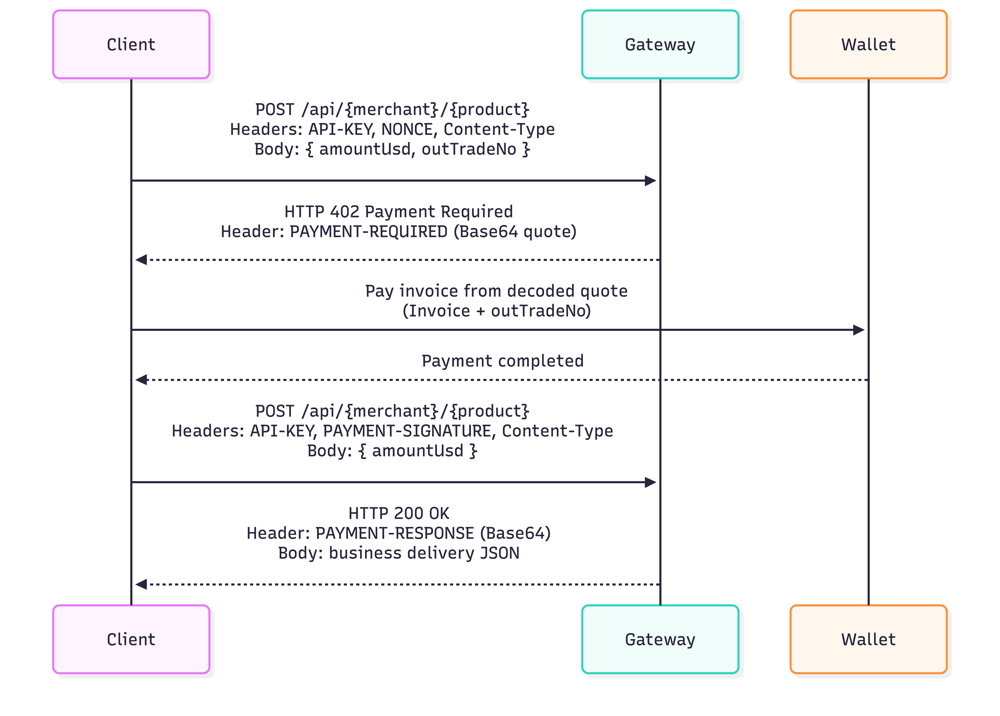

# xL402 Gateway Usage Guide

## 1. Overview

xL402 Gateway is a Lightning-native HTTP micropayment gateway that follows the x402-V2 HTTP transport specification. It uses standard HTTP status codes and headers (notably `402 Payment Required`) to provide seamless Lightning micropayment metering, billing, and cryptographic proof validation for any HTTP API. The interaction follows a standard three-phase x402 model:

1. Request a protected resource and receive an HTTP 402 quote.
2. Pay the Lightning invoice (QR or wallet extension).
3. Redeem payment credential and receive the protected resource (HTTP 200).

It uses standard HTTP status codes and Base64-encoded x402 headers for cross-system interoperability:

- `PAYMENT-REQUIRED`: quote payload returned in Phase 1.
- `PAYMENT-SIGNATURE`: signed payment credential submitted in Phase 3.
- `PAYMENT-RESPONSE`: settlement result returned in Phase 3 response.

---

## 2. Target Endpoint

```txt
https://xl402.bitdance.network/gateway/api/demo-tip-merchant/web-tip
```

### Endpoint Composition

- Base URL: `https://xl402.bitdance.network/gateway`
- API path prefix: `/api`
- Merchant code: `demo-tip-merchant`
- Product code: `web-tip`
- Full endpoint: `/api/demo-tip-merchant/web-tip`

Access requirement for these two fields:

- `merchantCode` and `productCode` are routing identifiers managed by the gateway.
- The merchant must pre-configure and enable this merchant-product route on the gateway before clients can access `/api/{merchantCode}/{productCode}`.
- If either value is not configured (or mismatched), requests may fail with route/resource validation errors (for example, quote not found, unauthorized product, or unavailable resource).

General pattern:

```txt
{baseUrl}/api/{merchantCode}/{productCode}
```

---

## 3. Interaction Flow Diagram


---

## 4. Standard Three-Phase Flow

### 4.1 Phase 1: Request Resource and Obtain 402 Quote

#### Request

Method:

```txt
POST
```

Headers:

- `API-KEY`: merchant API key
- `NONCE`: anti-replay unique value (UUID recommended)
- `Content-Type: application/json`

Body:

```json
{
  "amountUsd": 0.01,
  "outTradeNo": "b6191366509f45f896c8eecadf34e952"
}
```

#### Response (402)

- HTTP status: `402 Payment Required`
- Header: `PAYMENT-REQUIRED` (Base64)

Response Header: PAYMENT-REQUIRED (Base64):

```txt
eyJhY2NlcHRzIjpbeyJhbW91bnQiOiIxMyIsImFzc2V0Ijoic2F0IiwiZXh0cmEiOnsiY3VycmVuY3kiOiJzYXQiLCJkZXNjcmlwdGlvbiI6IldlYiBUaXAgRGVtbyBbQm9sdDExIEludm9pY2VdIiwiZXhwaXJlcyI6IjIwMjYtMDgtMjVUMDc6MDA6MjUuOTYyNDgxNjg0WiIsImV4dCI6eyJhbW91bnRVc2QiOjAuMDEsIm91dFRyYWRlTm8iOiJiNjE5MTM2NjUwOWY0NWY4OTZjOGVlY2FkZjM0ZTk1MiJ9LCJpbnZvaWNlIjoibG5iYzEzMG4xcDRnNndlZ3BwNWx0ZXZzdjdweWhtYWFyeXJxYXAzdnNtaHpjeTJ3cGpmbmNlNXFweHN3eGxoOW05ZXFwN3FkcTV0cTZycXYzcTJwc2hqbXQ5ZGU2cWNxenpzeHFycnNzc3A1bG42cWEwMzYwZDMzZ2RmOWFreHhnbHR0c2ozbmw5Y3Q3bTY0YXk1ZXBjOGd5eXMzdTMyczlxeHBxeXNncXY5dms2bGZueTd4ejVraDR2YW15NHg0eW52and4dHhydnp6YzAzdHdmcDRkeHdhcXV3dnJ3OW1yeDhoMDlkcGw3bjQ3dHA4cHpoYTlhMHN5djM2aGo0Mm15eTVrczc0MGRoazdmM3NxNDR5bHh4Iiwibm9uY2UiOiI5YjI2YzUyNS1lZGZmLTQ4NWYtODZjOC1mYmY1NWZhMDEzNzEiLCJvcmRlcklkIjoiY2ViZjE1MWJjOTcyNGE4YzlkYjU4NmJmN2RlNTQ5NGEiLCJzdWJTY2hlbWUiOiJsaWdodG5pbmctYm9sdDExIn0sIm1heFRpbWVvdXRTZWNvbmRzIjo2MDAsIm5ldHdvcmsiOiJiaXAxMjI6MDAwMDAwMDAwMDE5ZDY2ODljMDg1YWUxNjU4MzFlOTM0ZmY3NjNhZTQ2YTJhNmMxNzJiM2YxYjYwYThjZTI2ZiIsInBheVRvIjoiYmMxcDNqbGV6Yzl2NnRtbWZhZWRoamxqN3owc3g0NDdrank0ZG5wY2s2amZ3MDRyNTRuazRkeHM5Z2VxZjJAYml0Ym9vbS5mdW4iLCJzY2hlbWUiOiJleGFjdCJ9XSwicmVzb3VyY2UiOnsiZGVzY3JpcHRpb24iOiJXZWIgVGlwIERlbW8iLCJ1cmwiOiJkZW1vLXRpcC1tZXJjaGFudC93ZWItdGlwIn0sIng0MDJWZXJzaW9uIjoyfQ==
```

Decoded quote payload (JSON):

```json
{
  "accepts": [
    {
      "amount": "13",
      "asset": "sat",
      "extra": {
        "currency": "sat",
        "description": "Web Tip Demo [Bolt11 Invoice]",
        "expires": "2026-08-25T07:00:25.962481684Z",
        "ext": {
          "amountUsd": 0.01,
          "outTradeNo": "b6191366509f45f896c8eecadf34e952"
        },
        "invoice": "lnbc130n1p4g6wegpp5ltevsv7pyhmaaryrqap3vsmhzcy2wpjfnce5qpxswxlh9m9eqp7qdq5tq6rqv3q2pshjmt9de6qcqzzsxqrrsssp5ln6qa0360d33gdf9akxxglttsj3nl9ct7m64ay5epc8gyys3u32s9qxpqysgqv9vk6lfny7xz5kh4vamy4x4ynvjwxtxrvzzc03twfp4dxwaquwvrw9mrx8h09dpl7n47tp8pzha9a0syv36hj42myy5ks740dhk7f3sq44ylxx",
        "nonce": "9b26c525-edff-485f-86c8-fbf55fa01371",
        "orderId": "cebf151bc9724a8c9db586bf7de5494a",
        "subScheme": "lightning-bolt11"
      },
      "maxTimeoutSeconds": 600,
      "network": "bip122:000000000019d6689c085ae165831e934ff763ae46a2a6c172b3f1b60a8ce26f",
      "payTo": "bc1p3jlezc9v6tmmfaedhjlj7z0sx447kjy4dnpck6jfw04r54nk4dxs9geqf2@bitboom.fun",
      "scheme": "exact"
    }
  ],
  "resource": {
    "description": "Web Tip Demo",
    "url": "demo-tip-merchant/web-tip"
  },
  "x402Version": 2
}
```

### 4.2 Phase 2: QR / Extension Lightning Payment

Use the invoice from Phase 1 (`accepts[0].extra.invoice`) to complete payment. Two payment channels are supported:

#### QR Payment

Any wallet app that supports Bolt11 Invoice can scan and pay.

- QR content: the `invoice` value from `accepts[0].extra.invoice`.

#### Extension Payment

BitPocket extension payment requires both `outTradeNo` and `invoice` from Phase 1.

Recommended inputs:

- `API-KEY` (merchant API key)
- `invoice` (Bolt11 invoice)
- `outTradeNo` (from `accepts[0].extra.ext.outTradeNo`)

> See [LN Wallet API Send Sats By Invoice](/wallet-api/api-docs/ln/manage-assets.md#sendsatsbyinvoice) for extension payment API details.

### 4.3 Phase 3: Redeem Credential and Deliver Resource

#### Request

Method:

```txt
POST
```

Headers:

- `API-KEY`
- `PAYMENT-SIGNATURE`: Base64-encoded signed payment payload
- `Content-Type: application/json`

Body:

```json
{
  "amountUsd": 0.01
}
```

Request Header: PAYMENT-SIGNATURE (Base64):

```txt
eyJ4NDAyVmVyc2lvbiI6MiwicmVzb3VyY2UiOnsiZGVzY3JpcHRpb24iOiJXZWIgVGlwIERlbW8iLCJ1cmwiOiJkZW1vLXRpcC1tZXJjaGFudC93ZWItdGlwIn0sImFjY2VwdGVkIjp7ImFtb3VudCI6IjEzIiwiYXNzZXQiOiJzYXQiLCJleHRyYSI6eyJjdXJyZW5jeSI6InNhdCIsImRlc2NyaXB0aW9uIjoiV2ViIFRpcCBEZW1vIFtCb2x0MTEgSW52b2ljZV0iLCJleHBpcmVzIjoiMjAyNi0wOC0yNVQwNzowMDoyNS45NjI0ODE2ODRaIiwiZXh0Ijp7ImFtb3VudFVzZCI6MC4wMSwib3V0VHJhZGVObyI6ImI2MTkxMzY2NTA5ZjQ1Zjg5NmM4ZWVjYWRmMzRlOTUyIn0sImludm9pY2UiOiJsbmJjMTMwbjFwNGc2d2VncHA1bHRldnN2N3B5aG1hYXJ5cnFhcDN2c21oemN5MndwamZuY2U1cXB4c3d4bGg5bTllcXA3cWRxNXRxNnJxdjNxMnBzaGptdDlkZTZxY3F6enN4cXJyc3NzcDVsbjZxYTAzNjBkMzNnZGY5YWt4eGdsdHRzajNubDljdDdtNjRheTVlcGM4Z3l5czN1MzJzOXF4cHF5c2dxdjl2azZsZm55N3h6NWtoNHZhbXk0eDR5bnZqd3h0eHJ2enpjMDN0d2ZwNGR4d2FxdXd2cnc5bXJ4OGgwOWRwbDduNDd0cDhwemhhOWEwc3l2MzZoajQybXl5NWtzNzQwZGhrN2Yzc3E0NHlseHgiLCJub25jZSI6IjliMjZjNTI1LWVkZmYtNDg1Zi04NmM4LWZiZjU1ZmEwMTM3MSIsIm9yZGVySWQiOiJjZWJmMTUxYmM5NzI0YThjOWRiNTg2YmY3ZGU1NDk0YSIsInN1YlNjaGVtZSI6ImxpZ2h0bmluZy1ib2x0MTEifSwibWF4VGltZW91dFNlY29uZHMiOjYwMCwibmV0d29yayI6ImJpcDEyMjowMDAwMDAwMDAwMTlkNjY4OWMwODVhZTE2NTgzMWU5MzRmZjc2M2FlNDZhMmE2YzE3MmIzZjFiNjBhOGNlMjZmIiwicGF5VG8iOiJiYzFwM2psZXpjOXY2dG1tZmFlZGhqbGo3ejBzeDQ0N2tqeTRkbnBjazZqZncwNHI1NG5rNGR4czlnZXFmMkBiaXRib29tLmZ1biIsInNjaGVtZSI6ImV4YWN0In0sInBheWxvYWQiOnsibm9uY2UiOiI5YjI2YzUyNS1lZGZmLTQ4NWYtODZjOC1mYmY1NWZhMDEzNzEiLCJvcmRlcklkIjoiY2ViZjE1MWJjOTcyNGE4YzlkYjU4NmJmN2RlNTQ5NGEiLCJpbnZvaWNlIjoibG5iYzEzMG4xcDRnNndlZ3BwNWx0ZXZzdjdweWhtYWFyeXJxYXAzdnNtaHpjeTJ3cGpmbmNlNXFweHN3eGxoOW05ZXFwN3FkcTV0cTZycXYzcTJwc2hqbXQ5ZGU2cWNxenpzeHFycnNzc3A1bG42cWEwMzYwZDMzZ2RmOWFreHhnbHR0c2ozbmw5Y3Q3bTY0YXk1ZXBjOGd5eXMzdTMyczlxeHBxeXNncXY5dms2bGZueTd4ejVraDR2YW15NHg0eW52and4dHhydnp6YzAzdHdmcDRkeHdhcXV3dnJ3OW1yeDhoMDlkcGw3bjQ3dHA4cHpoYTlhMHN5djM2aGo0Mm15eTVrczc0MGRoazdmM3NxNDR5bHh4IiwicHJlaW1hZ2UiOiIifX0=
```

Decoded payment signature payload (JSON):

```json
{
  "x402Version": 2,
  "resource": {
    "description": "Web Tip Demo",
    "url": "demo-tip-merchant/web-tip"
  },
  "accepted": {
    "amount": "13",
    "asset": "sat",
    "extra": {
      "currency": "sat",
      "description": "Web Tip Demo [Bolt11 Invoice]",
      "expires": "2026-08-25T07:00:25.962481684Z",
      "ext": {
        "amountUsd": 0.01,
        "outTradeNo": "b6191366509f45f896c8eecadf34e952"
      },
      "invoice": "lnbc130n1p4g6wegpp5ltevsv7pyhmaaryrqap3vsmhzcy2wpjfnce5qpxswxlh9m9eqp7qdq5tq6rqv3q2pshjmt9de6qcqzzsxqrrsssp5ln6qa0360d33gdf9akxxglttsj3nl9ct7m64ay5epc8gyys3u32s9qxpqysgqv9vk6lfny7xz5kh4vamy4x4ynvjwxtxrvzzc03twfp4dxwaquwvrw9mrx8h09dpl7n47tp8pzha9a0syv36hj42myy5ks740dhk7f3sq44ylxx",
      "nonce": "9b26c525-edff-485f-86c8-fbf55fa01371",
      "orderId": "cebf151bc9724a8c9db586bf7de5494a",
      "subScheme": "lightning-bolt11"
    },
    "maxTimeoutSeconds": 600,
    "network": "bip122:000000000019d6689c085ae165831e934ff763ae46a2a6c172b3f1b60a8ce26f",
    "payTo": "bc1p3jlezc9v6tmmfaedhjlj7z0sx447kjy4dnpck6jfw04r54nk4dxs9geqf2@bitboom.fun",
    "scheme": "exact"
  },
  "payload": {
    "nonce": "9b26c525-edff-485f-86c8-fbf55fa01371",
    "orderId": "cebf151bc9724a8c9db586bf7de5494a",
    "invoice": "lnbc130n1p4g6wegpp5ltevsv7pyhmaaryrqap3vsmhzcy2wpjfnce5qpxswxlh9m9eqp7qdq5tq6rqv3q2pshjmt9de6qcqzzsxqrrsssp5ln6qa0360d33gdf9akxxglttsj3nl9ct7m64ay5epc8gyys3u32s9qxpqysgqv9vk6lfny7xz5kh4vamy4x4ynvjwxtxrvzzc03twfp4dxwaquwvrw9mrx8h09dpl7n47tp8pzha9a0syv36hj42myy5ks740dhk7f3sq44ylxx",
    "preimage": ""
  }
}
```

#### Response (200)

Response Header: PAYMENT-RESPONSE (Base64):

```txt
eyJleHRlbnNpb25zIjp7Imludm9pY2UiOiJsbmJjMTMwbjFwNGc2d2VncHA1bHRldnN2N3B5aG1hYXJ5cnFhcDN2c21oemN5MndwamZuY2U1cXB4c3d4bGg5bTllcXA3cWRxNXRxNnJxdjNxMnBzaGptdDlkZTZxY3F6enN4cXJyc3NzcDVsbjZxYTAzNjBkMzNnZGY5YWt4eGdsdHRzajNubDljdDdtNjRheTVlcGM4Z3l5czN1MzJzOXF4cHF5c2dxdjl2azZsZm55N3h6NWtoNHZhbXk0eDR5bnZqd3h0eHJ2enpjMDN0d2ZwNGR4d2FxdXd2cnc5bXJ4OGgwOWRwbDduNDd0cDhwemhhOWEwc3l2MzZoajQybXl5NWtzNzQwZGhrN2Yzc3E0NHlseHgiLCJzZXR0bGVkQXQiOjE3ODc2NDA2NjZ9LCJuZXR3b3JrIjoiYmlwMTIyOjAwMDAwMDAwMDAxOWQ2Njg5YzA4NWFlMTY1ODMxZTkzNGZmNzYzYWU0NmEyYTZjMTcyYjNmMWI2MGE4Y2UyNmYiLCJwYXllciI6ImFub255bW91cyIsInN1Y2Nlc3MiOnRydWUsInRyYW5zYWN0aW9uIjoiZmFmMmM4MzNjMTI1ZjdkZThjODMwNzQzMTY0Mzc3MTYwOGE3MDY0OTllMzM0MDA0ZDA3MWJmNzJlY2I5MDA3YyJ9
```

Response Header Decoded (JSON):

```json
{
  "extensions": {
    "invoice": "lnbc130n1p4g6wegpp5ltevsv7pyhmaaryrqap3vsmhzcy2wpjfnce5qpxswxlh9m9eqp7qdq5tq6rqv3q2pshjmt9de6qcqzzsxqrrsssp5ln6qa0360d33gdf9akxxglttsj3nl9ct7m64ay5epc8gyys3u32s9qxpqysgqv9vk6lfny7xz5kh4vamy4x4ynvjwxtxrvzzc03twfp4dxwaquwvrw9mrx8h09dpl7n47tp8pzha9a0syv36hj42myy5ks740dhk7f3sq44ylxx",
    "settledAt": 1787640666
  },
  "network": "bip122:000000000019d6689c085ae165831e934ff763ae46a2a6c172b3f1b60a8ce26f",
  "payer": "anonymous",
  "success": true,
  "transaction": "faf2c833c125f7de8c8307431643771608a706499e334004d071bf72ecb9007c"
}
```

Delivered response body (JSON):

```json
{
  "code": "200",
  "message": "Request successful",
  "data": {
    "merchantCode": "demo-tip-merchant",
    "productCode": "web-tip",
    "paidUsd": 0.01,
    "paidSat": 13,
    "validUntil": null,
    "msg": "payment already verified"
  },
  "succ": true
}
```

#### Response (402 Invoice unpaid)

For Step 3 settlement, a redemption failure can happen when the invoice is not paid.
In this case, `PAYMENT-RESPONSE` returns `success: false` with an `errorReason`.
`invalid_exact_lightning_invoice_unpaid` is one example to identify unpaid invoice, and there are other possible failure `errorReason` values as well.

Response Header: PAYMENT-RESPONSE (Base64):

```txt
eyJlcnJvclJlYXNvbiI6ImludmFsaWRfZXhhY3RfbGlnaHRuaW5nX2ludm9pY2VfdW5wYWlkIiwic3VjY2VzcyI6ZmFsc2V9
```

Response Header Decoded (JSON):

```json
{
  "errorReason": "invalid_exact_lightning_invoice_unpaid",
  "success": false
}
```

---

## 5. Field Reference

### 5.1 Request Headers

- `API-KEY`: Merchant authentication key.
- `NONCE`: Replay protection token for quote requests.
- `PAYMENT-SIGNATURE`: Base64 credential for settlement (Phase 3).
- `Content-Type`: Should be `application/json`.

### 5.2 Request Body

Phase 1 body:

- `amountUsd` (number): target payment amount in USD.
- `outTradeNo` (string): merchant/client order reference; recommended for wallet extension payment traceability.

Phase 3 body:

- `amountUsd` (number): settlement amount context.

### 5.3 `PAYMENT-REQUIRED` Decoded Quote Fields

Top-level:

- `x402Version`: x402 protocol version.
- `resource`: protected resource metadata.
- `accepts[]`: list of accepted payment methods/quotes.

`accepts[0]` common fields:

- `amount`: satoshi amount as string.
- `asset`: payment asset, usually `sat`.
- `scheme`: payment mode, e.g. `exact`.
- `network`: chain/network identifier.
- `payTo`: receiver identity/address info.
- `maxTimeoutSeconds`: quote timeout.
- `extra`: invoice and business extension data.

`accepts[0].extra`:

- `invoice`: Bolt11 invoice used in Phase 2.
- `nonce`: quote-side nonce.
- `orderId`: gateway order identifier.
- `expires`: quote expiration timestamp.
- `subScheme`: Lightning method detail.
- `ext.amountUsd`: business USD amount snapshot.
- `ext.outTradeNo`: business order reference used by extension flow.

### 5.4 `PAYMENT-SIGNATURE` Decoded Fields

Top-level:

- `x402Version`
- `resource`
- `accepted`: copied quote item being redeemed.
- `payload`: settlement payload.

`payload`:

- `nonce`: nonce for settlement verification.
- `orderId`: quote order identifier.
- `invoice`: Bolt11 invoice string.
- `preimage`: preimage value (empty string allowed in this flow when gateway verifies settled status).

### 5.5 `PAYMENT-RESPONSE` Decoded Fields

- `success` (boolean): settlement verification result.
- `errorReason` (string, optional): failure reason code when `success = false`.
- `transaction` (string): payment transaction identifier/hash.
- `network` (string): network identifier.
- `payer` (string): payer identity (if available).
- `extensions.invoice` (string): related invoice.
- `extensions.settledAt` (number): settlement timestamp (epoch seconds).

Failure note:

- `invalid_exact_lightning_invoice_unpaid` indicates the invoice was not paid at redemption time.
- This is only one failure case. Other `errorReason` values may be returned for different settlement failures.

### 5.6 Delivered Response Body Fields

Top-level:

- `code`: business status code (`"200"` for success).
- `message`: response message.
- `succ`: success flag.
- `data`: delivered business payload.

`data`:

- `merchantCode` (string): merchant identifier resolved by the gateway, e.g. `demo-tip-merchant`.
- `productCode` (string): product/resource code resolved by the gateway, e.g. `web-tip`.
- `paidUsd` (number): USD amount recognized and settled for this request.
- `paidSat` (number): satoshi amount recognized and settled for this request.
- `validUntil` (string | null): optional validity deadline for delivered data/resources. `null` means no extra validity window is applied.
- `msg` (string): business-level settlement message, e.g. `payment already verified`.

Configuration note:

- `merchantCode` and `productCode` in the success payload indicate which configured merchant/product route actually handled the request.
- These values are not arbitrary client inputs in production usage; they should correspond to merchant routes pre-registered on the gateway.

For a successful settlement, this response usually appears as:

- `code = "200"`
- `succ = true`
- `data.paidUsd` and `data.paidSat` are typically present and positive for paid resources

---

## 6. CURL Examples

### Phase 1: Get a quote (402)

```bash
curl -X POST https://xl402.bitdance.network/gateway/api/demo-tip-merchant/web-tip \
  -H "API-KEY: <YOUR_API_KEY>" \
  -H "NONCE: 738aab87-fdde-4eb2-b072-02d7a22b306a" \
  -H "Content-Type: application/json" \
  -d '{"amountUsd": 0.01, "outTradeNo": "b6191366509f45f896c8eecadf34e952"}' -v
```

### Phase 3: Redeem with PAYMENT-SIGNATURE

```bash
curl -X POST https://xl402.bitdance.network/gateway/api/demo-tip-merchant/web-tip \
  -H "API-KEY: <YOUR_API_KEY>" \
  -H "PAYMENT-SIGNATURE: <BASE64_PAYMENT_SIGNATURE>" \
  -H "Content-Type: application/json" \
  -d '{"amountUsd": 0.01}' -v
```

---

## 7. Practical Notes

- Always preserve and reuse `outTradeNo` from Phase 1 for extension-based payment flows.
- Treat quote data as short-lived. `expires` and `maxTimeoutSeconds` define validity.
- For settlement success, prioritize `PAYMENT-RESPONSE` decoded `success: true` together with HTTP `200`.
- Keep `NONCE` unique for new quote requests to avoid replay risks.
